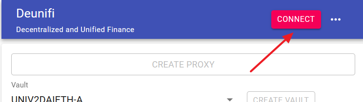

# Getting Started

## Connecting

First of all to perform an investment using Deunifi, you must connect using Metamask.


At the time of writing we are supporting only Metamask, but we are working to integrate more wallets to our App.


## Proxy Creation

To perform any transaction in Deunifi, it is used the MakerDAO proxy associated with the connected account.

If you already own a proxy in MakerDAO you can skip this section


If you own a proxy in MakerDAO, then the Deunifi App it is going to automatically recognize your proxy, and the 'CREATE PROXY' button will disappear.



The proxy creation it is done only once. Once created, it is used that proxy for all the transactions done in Deunifi App. 


The proxy creation it is very simple. You only need to click the 'CREATE PROXY' button:

Then you have to confirm the Metamask's popup with the transaction details:


Remember that to perform any transaction in the Ethereum network you are going to need ETH.


After the transaction is confirmed, a message confirm this, and you can access to it in Etherscan. Additionally, after a few seconds the 'CREATE PROXY' button will disappear and the 'CREATE VAULT' button will be available:

## Vault Creation

To perform a transaction with Deunifi, first you need to have a vault. 

The vault to create depends on the kind of investment you want to perform.


Checkout our [Vault Classification](core-concepts/vault-classification.md) section to understand better the different kind of vaults.



If you already own a MakerDAO vault, you can skip this section.


Once defined the vault type to create, simply select it from the drop down box, and click on 'CREATE VAULT' button.

Then perform the transaction using Metamask.

After a few seconds the transaction is confirmed in the network, the Vault drop down is going to change automatically displaying the vault created for your account.

A link to checkout your created vault in Oasis is going to be displayed instead of the 'CREATE VAULT' button. 


Please note that you can create more than one vault for same vault type in case you need it.


## Lock And Draw

