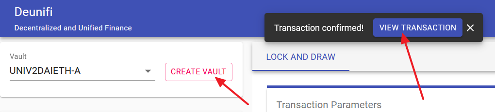

# Getting Started

## Connecting

First of all to perform an investment using Deunifi, you must connect using Metamask.


At the time of writing we are supporting only Metamask, but we are working to integrate more wallets to our App.


## Proxy Creation

To perform any transaction in Deunifi, it is used the MakerDAO proxy associated with the connected account.

If you already own a proxy in MakerDAO you can skip this section


If you own a proxy in MakerDAO, then the Deunifi App it is going to automatically recognize your proxy, and the 'CREATE PROXY' button will disappear.



The proxy creation it is done only once. Once created, it is used that proxy for all the transactions done in Deunifi App. 


The proxy creation it is very simple. You only need to click the 'CREATE PROXY' button:

Then you have to confirm the Metamask's popup with the transaction details:


Remember that to perform any transaction in the Ethereum network you are going to need ETH.


After the transaction is confirmed, a message confirm this, and you can access to it in Etherscan. Additionally, after a few seconds the 'CREATE PROXY' button will disappear and the 'CREATE VAULT' button will be available:

## Vault Creation

The vault to be created depends on the kind of investment you want to invest.


If you already owns a MakerDAO where you want to invest, you can skip this section.


### Vault Classification

We can classify the different vault types in 3 groups depending on the tokens associated with them and the tokens volatility:

* The group of high volatility vaults composed with two high volatile tokens \(for example UNIV2WBTCETH-A that it is composed with WBTC and ETH\).
* The group of middle volatility vaults composed with one volatile token and one stable coin token \(for example UNIV2DAIETH-A that it is composed with DAI and ETH\).
* The group of stable vaults composed with two stable coin tokens \(for example UNIV2DAIUSDC-A that it is composed with DAI and USDC\)

### High Volatility Vaults

The main characteristics of this kind of vaults are:

* In case of tokens price increasing, the value is conserved. 
* The APY for this vaults are generally low.
* Collateralization ratio:
  * A collateralization ratio of 300% means that you are investing +50% of your initial investment:
    * If the price of the assets increase, you are going to gain an additional 50% of value regarding initial price.
    * Additionally you are going to gain +50% on fees.
  * Liquidations ratio for this vaults are high \(generally between 150% and 175%\) 


This vaults are great to earn an extra on your assets' value and earn an extra on liquidity pool fees.



Generally the risks are higher with this kind of vaults.


### Middle Volatility Vaults

The main characteristics of this kind of vaults are:

* In case of tokens price increasing, impermanent loss are mitigated and value could be conserved \(for more information please checkout 'Deunifi Investments Benefits'\).
* The APY for this vaults are generally high.
* Collateralization ratio:
  * A collateralization ratio of 200% means that you are investing +100% of your initial investment:
    * If the price of the assets increase, you are going to conserve 100% of value of the volatile token regarding initial price.
    * Additionally you are going to gain +100% on fees.
  * Liquidations ratio for this vaults are lower \(generally between 125% and 140%\)


This vaults are great to to conserve the value of the volatile token and earn an extra on liquidity pool fees.



Generally the risks are lower with this kind of vaults.


### Stable Vaults

The main characteristics of this kind of vaults are:

* The value is conserved because are composed with two stable coin tokens.
* The APY for liquidity pools collateral are generally low, but depending on collateralization ratio can be transformed in higher APYs.
* Collateralization ratio:
  * Is is possible to be in the limit of the liquidation ratio because it is expected the price of both stable coins shoud be stable.
  * Liquidations ratio for this vaults are the lowest \(generally between 102% and 125%\)
  * For example in a vault with 102% liquidation ratio can be achieved an investment of forty times \(x40\) the initial investment.


This vaults are great when you are searching an investment with the lowest risk and APY higher than other options in the market.


